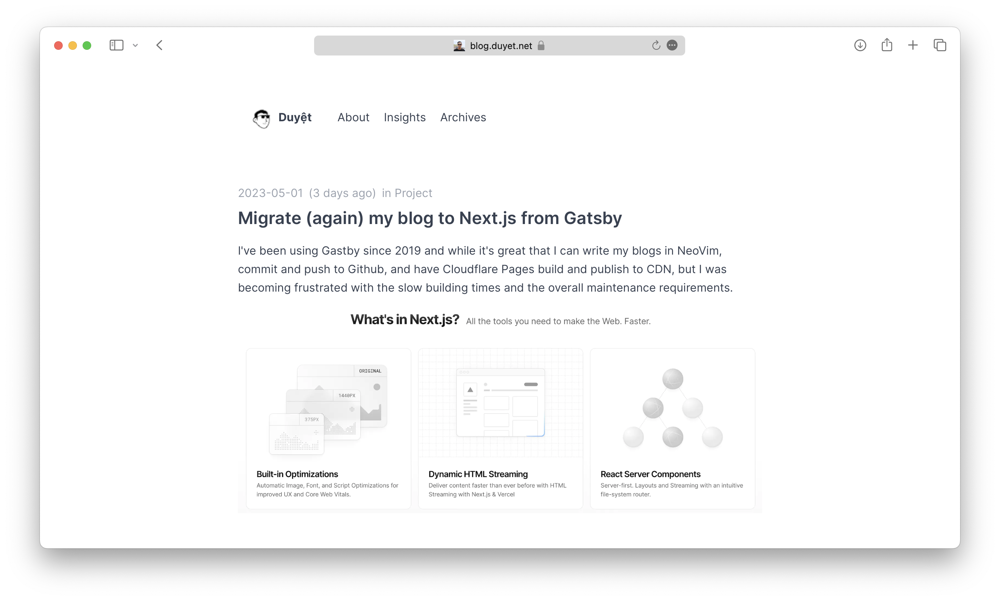
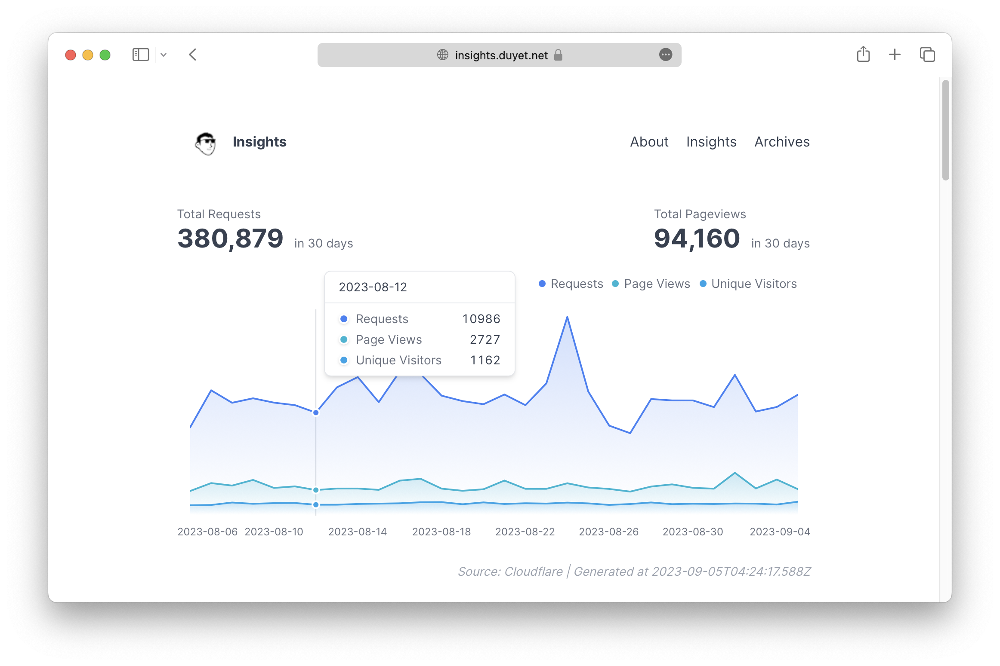

# duyet.net

This monorepo contains the Nextjs version of the blog, cv, photo, etc.

- **Home**: https://duyet.net (official) | https://duyet-home.pages.dev (Cloudflare)
- **Blog**: https://blog.duyet.net (official) | https://duyet.vercel.app (Vercel) | https://duyet-blog.pages.dev (Cloudflare)
- **CV**: https://cv.duyet.net (official) | https://duyet-cv.vercel.app (Vercel) | https://duyet-cv.pages.dev (Cloudflare)
- **Insights**: https://insights.duyet.net (official) | https://duyet-insights.vercel.app (Vercel) | https://duyet-insights.pages.dev (Cloudflare)
- **Photos**: https://photos.duyet.net (official) | https://duyet-photos.pages.dev (Cloudflare)
- **Homelab**: https://duyet-homelab.pages.dev (Cloudflare)

## 1. Blog

See the [./apps/blog/README.md](./apps/blog/README.md)

## 2. Insights

See the [./apps/insights/README.md](./apps/insights/README.md)

## 3. CV

See the [./apps/cv/README.md](./apps/cv/README.md)

---

