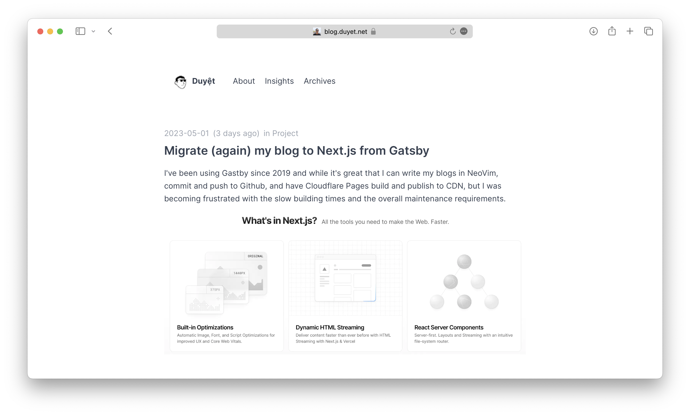
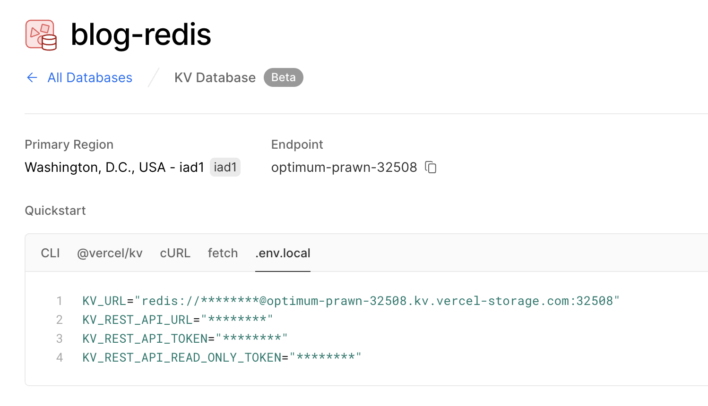

# Duyet Data Engineering Blog

This repository contains the Nextjs version of the blog, which has been migrated from the old Gatsby version.
The blog is now integrated with Auth0 for authentication and Vercel Storage KV for serverless Redis storage to support comments.

- **Live: https://duyet.vercel.app**
- **Live: https://blog.duyet.net**



## What's New?

- The blog has been rewritten in Nextjs to improve performance and simplify the codebase.
- Comments are now supported by Auth0 and stored at Serverless Redis (Upstash).

## Deployment

If you would like to deploy your own instance of the blog, follow these instructions:

### `1` Clone the repository:

```bash
git clone https://github.com/duyet/blog.git
```

### `2` Set up environment variables

Copy the `.env.local.example` file in this directory to `.env.local` (which will be ignored by Git):

```bash
cp .env.local.example .env.local
```

or clone from Vercel deploy

```bash
vercel env pull .env.local
```

### `3` Configuring Vercel Storage KV

Go to the **Vercel Storage** and create a new database. Copy the .env.local from Vercel UI.



- `KV_URL`
- `KV_REST_API_URL`
- `KV_REST_API_TOKEN`
- `KV_REST_API_READ_ONLY_TOKEN`

### `4` Configuring Auth0

1. Go to the [Auth0 dashboard](https://manage.auth0.com/) and create a new application of type **Single Page Web
   Applications**.
2. Go to the settings page of the application
3. Configure the following settings:
   - **Allowed Callback URLs**: Should be set to `http://localhost:3000/` when testing locally or typically
     to `https://myapp.com/` when deploying your application.
   - **Allowed Logout URLs**: Should be set to `http://localhost:3000/` when testing locally or typically
     to `https://myapp.com/` when deploying your application.
   - **Allowed Web Origins**: Should be set to `http://localhost:3000` when testing locally or typically
     to `https://myapp.com/` when deploying your application.
4. Save the settings.

#### Auth0 environment

- `NEXT_PUBLIC_AUTH0_DOMAIN`: Can be found in the Auth0 dashboard under `settings`.
- `NEXT_PUBLIC_AUTH0_CLIENT_ID`: Can be found in the Auth0 dashboard under `settings`.
- `NEXT_PUBLIC_AUTH0_ADMIN_EMAIL`: This is the email of the admin user which you use while signing in Auth0. Admin is able to delete any comment.

### `5` Configuring Cloudflare

Follow this to create Cloudflare API key:
https://developers.cloudflare.com/analytics/graphql-api/getting-started/authentication/api-key-auth/

- `NEXT_PUBLIC_CLOUDFLARE_API_KEY`: Cloudflare API Key
- `NEXT_PUBLIC_CLOUDFLARE_ZONE_ID`: Cloudflare Zone, see https://developers.cloudflare.com/fundamentals/get-started/basic-tasks/find-account-and-zone-ids/

## Deploy Your Local Project

To deploy your local project to Vercel, push it to GitHub/GitLab/Bitbucket
and [import to Vercel](https://vercel.com/new?utm_source=github&utm_medium=readme&utm_campaign=upstash-roadmap).

**Important**: When you import your project on Vercel, make sure to click on **Environment Variables** and set them to
match your `.env.local` file.

---


