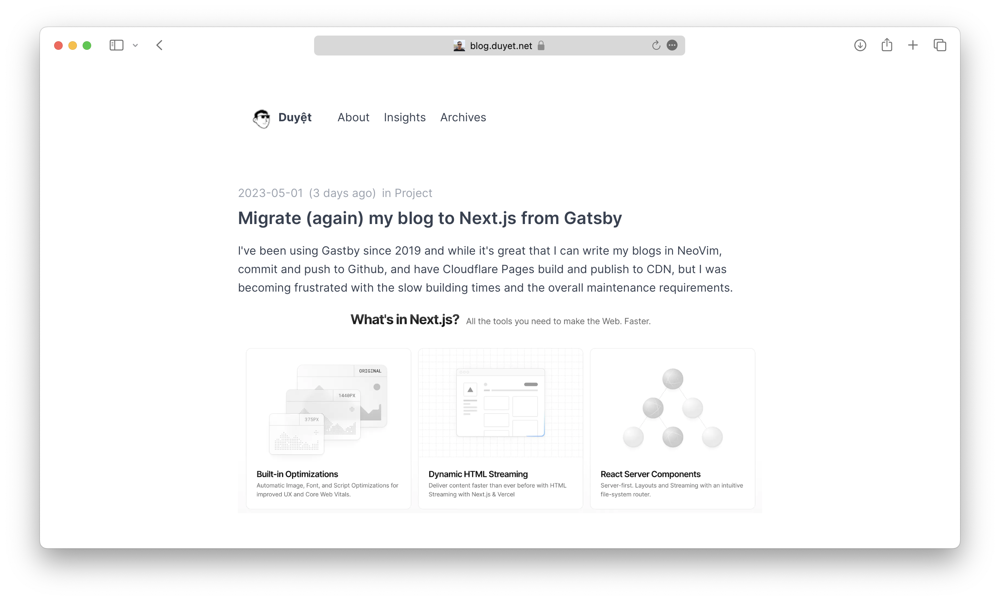

# Duyet Blog

Personal blog with MDX posts, KaTeX math rendering, and static pre-rendering.

- **Live**: https://blog.duyet.net (official)
- **Live**: https://duyet-blog.pages.dev (Cloudflare Pages)



## What's New?

- Migrated from Vite SPA to **TanStack Start** with static pre-rendering for improved performance and SEO
- Content is pre-rendered at build time for improved SEO and faster initial page loads
- Uses Vite + TanStack Router for file-based routing
- Supports Markdown/MDX posts with KaTeX math, syntax highlighting, and RSS feed

## Development

```bash
# Install dependencies
bun install

# Start development server
bun run dev

# Build for production
bun run build

# Run tests
bun run test

# Type checking
bun run check-types

# Linting
bun run lint
```

## Deployment

The blog is deployed to Cloudflare Pages via GitHub Actions.

### Local Deployment

```bash
# Deploy to preview
bun run cf:deploy

# Deploy to production
bun run cf:deploy:prod
```

### Environment Variables

Environment variables are defined at the monorepo root in `.env` or `.env.local`:

```bash
# Cross-app navigation
VITE_DUYET_BLOG_URL=https://blog.duyet.net
VITE_DUYET_CV_URL=https://cv.duyet.net
VITE_DUYET_INSIGHTS_URL=https://insights.duyet.net

# Analytics (optional)
VITE_MEASUREMENT_ID=G-XXXXXXXXX
```

### Adding a New Post

1. Create a new file in `_posts/YYYY-MM-DD-slug.md` or `_posts/YYYY-MM-DD-slug.mdx`
2. Add frontmatter:

   ```markdown
   ---
   title: "Post Title"
   date: "2025-01-15"
   category: "Data Engineering"
   tags: ["rust", "clickhouse"]
   series: "series-name"
   ---
   ```

3. Write content in Markdown or MDX
4. Math: use `$inline$` or `$$block$$` KaTeX syntax
5. Code blocks get syntax highlighting automatically

### Build Process

- Prebuild steps generate post data and static files
- TanStack Start pre-renders all routes at build time
- Output is optimized for Cloudflare Pages deployment
- RSS feed and sitemap are auto-generated

## Architecture

- **Framework**: Vite + TanStack Router + TanStack Start
- **Styling**: Tailwind CSS v4
- **Content**: MDX posts with KaTeX math and syntax highlighting
- **Package Manager**: Bun
- **Deployment**: Cloudflare Pages (static pre-rendering)

## Documentation

See [CLAUDE.md](./CLAUDE.md) for detailed development patterns, project structure, and common tasks.

---

**This repository is maintained by [@duyetbot](https://github.com/duyetbot).**
