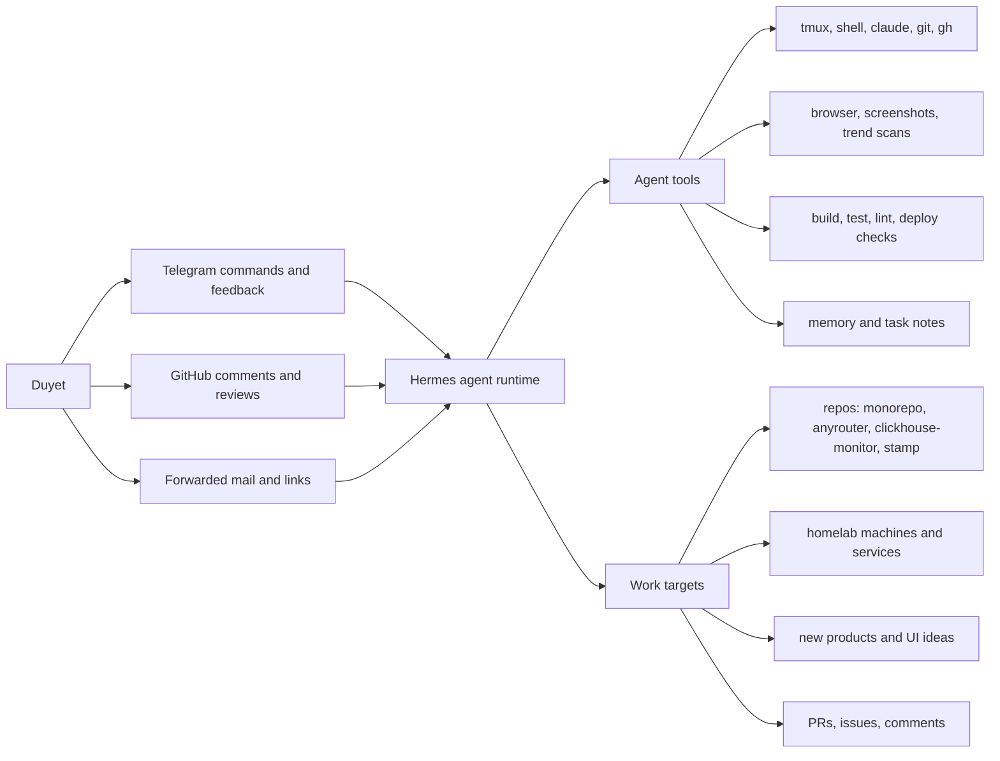
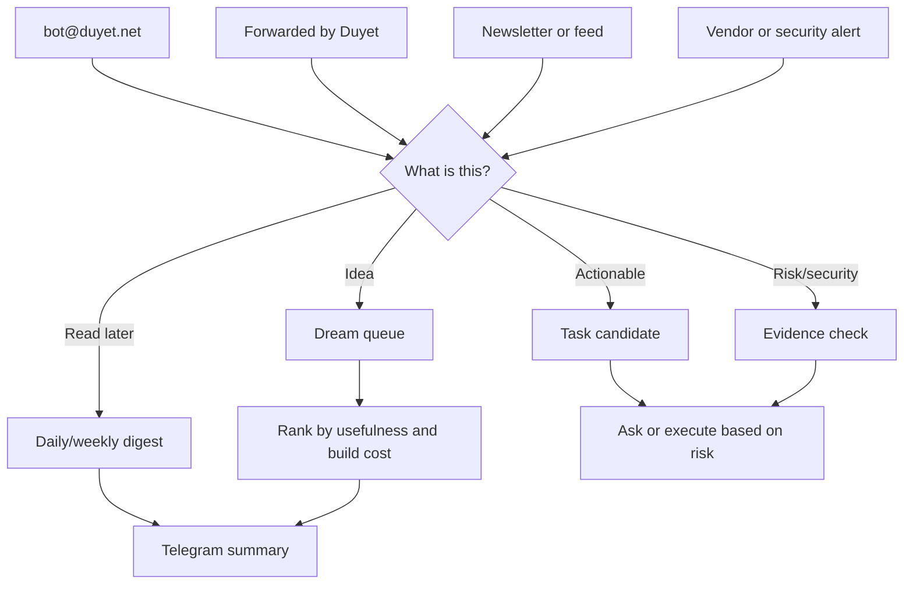
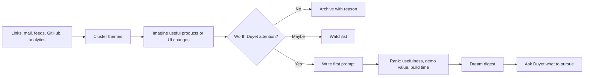
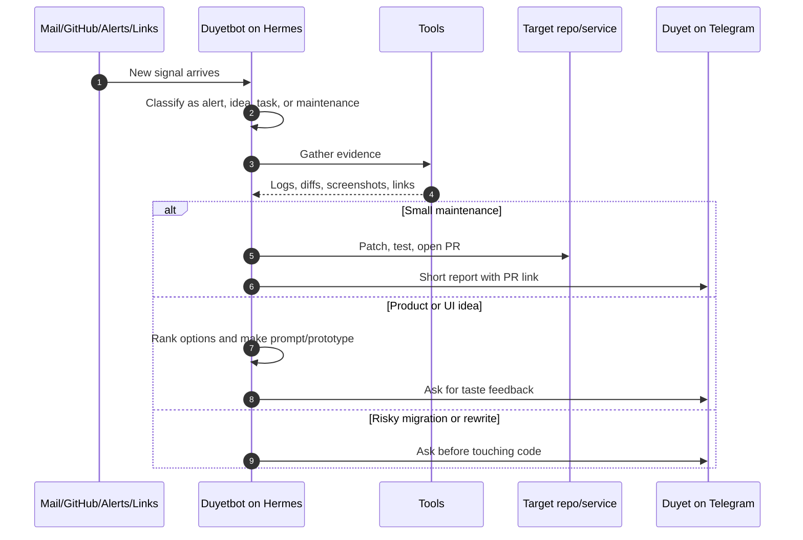
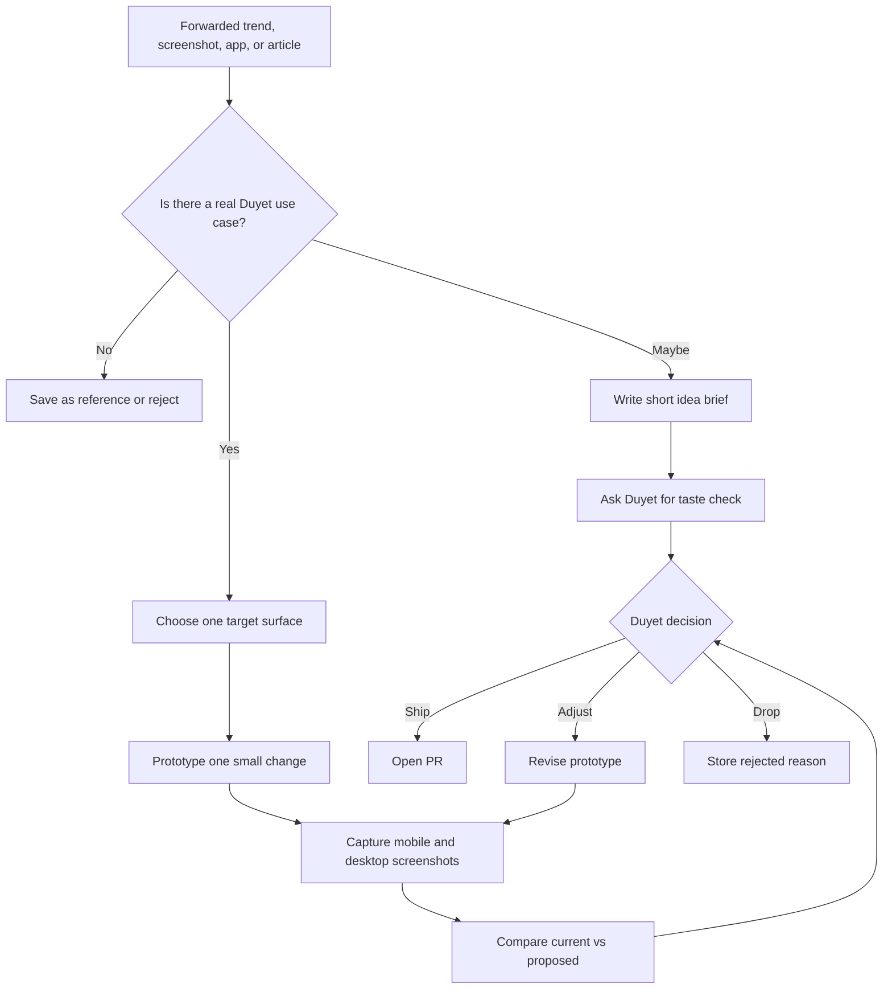
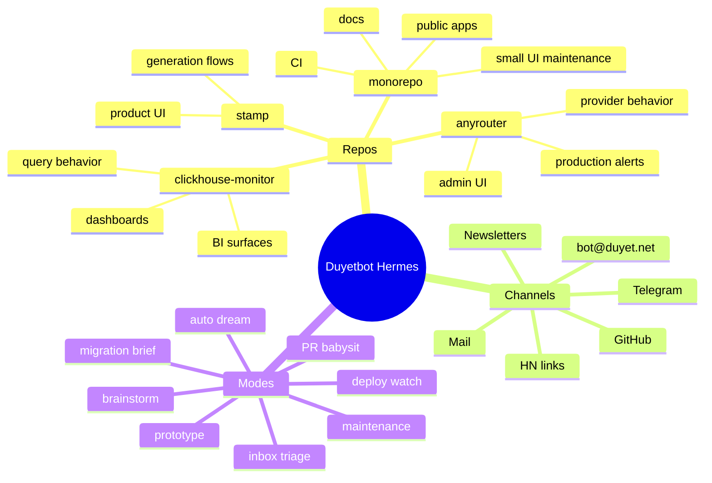
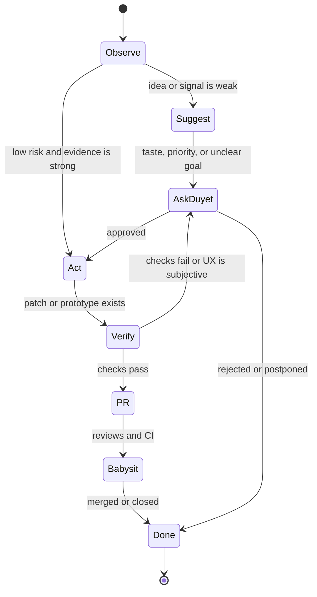

# Duyetbot Hermes Agent Usage

This is a practical usage guide for Duyetbot as a Hermes-powered personal
automation agent. Duyetbot is the identity. Hermes is the current agent runtime.
OpenClaw was the earlier engine. The `monorepo` is only one maintenance target
among many repos, machines, dashboards, subscriptions, and product ideas.

The goal is not to build one internal repo agent. The goal is to keep a useful
background operator that can watch, think, build, test, ask questions, and ship
small improvements while Duyet stays in control of taste, risk, and priorities.

## How Duyet Uses It

- Telegram is the fast control surface: send ideas, approve risky work, reject
  bad directions, ask for status, and give taste feedback.
- GitHub is the work surface: issues, PRs, review comments, checks, merge
  decisions, and maintenance tasks.
- Mail and subscriptions are the discovery surface: `bot@duyet.net`,
  newsletters, release notes, security advisories, UI/UX trends, product
  inspiration, and anything Duyet forwards.
- Repos are task targets: `monorepo` is one repo for maintenance; other repos can
  receive bug fixes, experiments, docs updates, PR review, deploys, or audits.
- Homelab and VM services are runtime targets: Hermes can use the installed
  coding tools, shells, tmux sessions, logs, and deployment commands.
- Duyet remains the decision maker for big moves: rewrites, stack migrations,
  public UI direction, account changes, data deletion, and production-risky
  deploys.

## Control Surface



## Setup

### 1. Identity

Create one stable identity:

- Name: `duyetbot`
- Runtime: Hermes agent
- Previous runtime: OpenClaw
- Human owner: Duyet
- Default behavior: cautious autonomous assistant, not a human replacement

The identity should know:

- It may propose work without asking.
- It may implement low-risk maintenance tasks.
- It must ask before risky production, billing, account, data, stack, or full
  rewrite changes.
- It should preserve current UX and existing features unless Duyet explicitly
  approves removal or replacement.

### 2. Channels

Use separate channels so notifications do not pollute actionable sessions.

| Channel             | Purpose                                                | Agent Behavior                                |
| ------------------- | ------------------------------------------------------ | --------------------------------------------- |
| `duyetbot-alerts`   | noisy alerts, CI failures, monitoring, mail summaries  | summarize and link evidence                   |
| `duyetbot-commands` | actionable tasks from Duyet                            | execute, ask if unclear, report result        |
| `duyetbot-reviews`  | PR review, CI babysitting, merge status                | keep status short and concrete                |
| `duyetbot-ideas`    | UI/UX trends, product ideas, weekend projects          | brainstorm and make ranked options            |
| `bot@duyet.net`     | newsletters, forwarded things, product links, receipts | read, tag, summarize, and route               |
| `duet-company`      | multi-agent experiments                                | coordinate agents and ask for human decisions |

This separation matters. Alerts and commands should not share the same long
agent session if Hermes uses chat identity or history as context.

### 3. Tool Access

Give Hermes the minimum useful access:

- Shell access on the VM where it runs.
- `tmux` sessions for long-running work.
- `git` and `gh` authenticated for the repos it can maintain.
- Installed coding tools such as `claude`, `codex`, Bun, Node, Python, Wrangler,
  or repo-specific CLIs.
- Browser/screenshot tooling for UI checks.
- Mail/news input as summaries or forwarded messages.
- A skill registry for maintenance, PR review, research, UI critique,
  prototype, deploy watch, migration review, and dream mode.
- A repo registry that lists allowed repos, default branches, deploy commands,
  and risky commands.

### 4. Repo Registry

Track repos as targets, not as the center of the system.

```yaml
repos:
  monorepo:
    purpose: public apps maintenance
    default_branch: master
    normal_work: docs, UI polish, CI, dead code, small fixes
    risky_work: public redesign, deploy config, auth, data deletion
  anyrouter:
    purpose: router product and production ops
    normal_work: alerts, docs, UI/admin fixes, CI babysit
    risky_work: billing, provider routing, production deploys
  clickhouse-monitor:
    purpose: BI and monitoring product
    normal_work: dashboard UX, query fixes, PR babysit
    risky_work: data-source migration, auth, customer-visible behavior
```

### 5. Daily Inputs

Give Duyetbot a daily feed:

- GitHub notifications and PR checks.
- Repos with changed files since the last run.
- Monitoring alerts and production errors.
- New mail/newsletters from selected subscriptions and `bot@duyet.net`.
- Hacker News, design feeds, release notes, and dependency advisories.
- WakaTime, analytics, or activity summaries if useful.

### 6. Subscription Inbox

`bot@duyet.net` is the default catch-all inbox for Duyetbot. Subscribe it to
newsletters, product updates, security advisories, GitHub notifications, design
feeds, vendor release notes, and anything that may become useful later.

Forwarded mail should be treated as stronger signal than a normal subscription.
If Duyet forwards something, Hermes should assume it is worth at least one of:

- summarize and archive
- turn into a product idea
- compare against current projects
- create a small research note
- ask one follow-up question
- produce an implementation prompt
- open a ticket or draft PR only when explicitly asked



### 7. Skill Router

Hermes should auto-decide which skill to use before acting. It should not run
every tool for every signal.

| Signal                    | Skill              | Allowed Default Action                               |
| ------------------------- | ------------------ | ---------------------------------------------------- |
| forwarded product link    | idea scout         | summarize, compare, ask                              |
| newsletter trend          | dream mode         | cluster into ideas                                   |
| PR failure                | PR babysit         | inspect, comment, fix if safe                        |
| repo drift                | maintenance        | patch only if evidence-backed                        |
| UI screenshot             | design critic      | compare, propose, prototype only if asked            |
| dependency/security alert | verifier           | confirm against repo manifests                       |
| repeated production error | operator           | investigate and request approval before risky deploy |
| stack pain                | migration reviewer | write migration brief, no code                       |

Skill choice should be visible in status messages:

```text
skill: dream mode
input: forwarded newsletter about local-first apps
decision: no code; created 3 product ideas and 1 prototype prompt
```

### 8. Auto Dream

Auto dream is the background ideation loop. It is allowed to combine weak
signals into useful ideas, but it should not silently rewrite products or create
large PRs.

Dream sources:

- forwarded links and emails
- newsletters
- GitHub starred repos
- Hacker News links
- UI screenshots
- analytics oddities
- repeated manual tasks
- old rejected ideas
- repo maintenance pain

Dream outputs:

- one-line idea
- why now
- target user
- first prototype
- estimated build time
- likely repo or product target
- prompt to start implementation
- reason to reject or watch



Dream digest format:

```text
dream digest

1. Local-first analytics notebook
   Why: 3 links this week point to local-first BI workflows.
   Prototype: static SQLite/WASM import page.
   Build time: 1-2 days.
   First prompt: "Build a local CSV-to-dashboard prototype..."

2. Agent UI review mode
   Why: repeated PR review and screenshot tasks.
   Prototype: compare current/proposed screenshots with notes.
   Build time: half day.

Rejected:
- full app framework migration: no concrete pain yet
```

## Daily Operating Loop



## Command Patterns

Use short commands when context is already clear:

```text
check monorepo maintenance today
```

```text
babysit this PR until it is mergeable. do not merge if draft.
```

```text
look at this UI trend and tell me if it fits duyet.net
https://example.com/link
```

```text
scan my subscribed AI newsletters and propose 3 weekend projects.
```

```text
triage bot@duyet.net today. show only things worth my attention.
```

```text
use dream mode on everything I forwarded this week. no code.
```

```text
auto-pick the right skill for this. explain the skill choice first.
<forwarded link or task>
```

```text
there is an alert for anyrouter. verify if real. if safe, fix and PR.
```

```text
brainstorm a better agents.duyet.net UI. no code yet. give me 3 directions with tradeoffs.
```

Use explicit constraints for bigger work:

```text
Use Hermes as @duyetbot.
Target: apps/agent-ui in monorepo.
Goal: improve mobile chat usability.
Constraints:
- no route changes
- no auth changes
- preserve current features
- ask before deploy
Output:
- screenshots
- files changed
- test output
- PR link if you implement
```

## Prompt Cookbook

### Maintenance Sweep

```text
@duyetbot maintenance sweep for monorepo.

Scope:
- recent commits since last run
- docs drift
- CI failures
- dead code only if zero non-test references

Rules:
- keep changes surgical
- no feature changes
- no dated review docs
- ask before deploy

Finish with:
- findings
- commands run
- PR link or "no change needed"
```

### PR Babysit

```text
@duyetbot babysit PR <url>.

Check:
- mergeability
- review comments
- CI status
- whether the PR is draft

Act:
- fix only actionable unresolved comments
- rerun the narrowest useful checks
- ask me before admin merge or risky deploy

Report:
- current status
- blockers
- next action
```

### UI/UX Idea Review

```text
@duyetbot review this UI/UX idea:
<link or screenshot>

Compare it to Duyet style.
Tell me:
- what is useful
- what does not fit
- one small experiment
- one route/component to prototype
- how to measure if it worked

No code unless I say implement.
```

### Build A Prototype

```text
@duyetbot prototype this idea.

Target:
- app/page/component:
- user problem:
- inspiration links:

Constraints:
- keep current features
- no backend changes unless necessary
- mobile must work
- use screenshots for proof

Output:
- preview URL or screenshots
- changed files
- test output
- what you intentionally did not change
```

### Product Brainstorm

```text
@duyetbot brainstorm 10 product ideas from my last week of links, starred repos,
and newsletters.

Rank by:
- build time
- usefulness to me
- public demo value
- chance it becomes a reusable product

Then pick the top 3 and write first implementation prompts.
```

### Inbox Triage

```text
@duyetbot triage bot@duyet.net.

Inputs:
- newsletters
- forwarded messages from me
- vendor emails
- GitHub notifications
- product/design links

Output:
- urgent items
- useful things to read
- ideas worth dreaming on
- things to ignore
- one recommended next action

Rules:
- do not unsubscribe or reply unless I ask
- do not open PRs from email alone
- ask before treating vendor/security mail as real
```

### Auto Dream

```text
@duyetbot dream for 30 minutes.

Use:
- bot@duyet.net
- things I forwarded
- recent HN/design/product links
- current repo pain
- repeated manual tasks

Output:
- 5 ideas
- 3 rejected ideas with reasons
- 1 best prototype prompt
- skill you would use to build it

No code, no PR, no deploy.
```

### Auto Skill Choice

```text
@duyetbot auto-decide the skill for this task:
<task, link, PR, email, screenshot, or alert>

Before acting, reply with:
- selected skill
- why this skill
- risk level
- whether you need my approval

Then act only if it is low-risk.
```

### Stack Migration Review

```text
@duyetbot evaluate whether we should migrate <thing> to <new stack>.

Do not implement.
Bring evidence:
- current pain
- exact files or incidents
- what improves
- what gets worse
- migration phases
- rollback plan
- decision: migrate, wait, or reject
```

## UI/UX Trend Loop



## Work Type Matrix

| Work Type              | Can Auto-Act? | Needs Duyet?                        | Example                         |
| ---------------------- | ------------- | ----------------------------------- | ------------------------------- |
| CI babysit             | yes           | only if blocked or risky merge      | fix failing lint in PR          |
| Dead-code cleanup      | yes           | no, if evidence is strong           | remove zero-reference component |
| Minor docs drift       | yes           | no                                  | update setup command            |
| Inbox triage           | yes           | no                                  | summarize `bot@duyet.net`       |
| Auto dream             | yes           | before implementation               | propose ideas from feeds        |
| Small UI polish        | draft or PR   | yes before merge if taste-sensitive | mobile wrapping fix             |
| New product idea       | no            | yes                                 | weekend project proposal        |
| Stack migration        | no            | yes                                 | move app framework or DB        |
| Full UI rewrite        | no            | yes                                 | redesign `duyet.net`            |
| Production deploy      | maybe         | yes if risky or not routine         | deploy changed Cloudflare app   |
| Billing/account change | no            | yes                                 | provider plan or token scope    |

## Maintenance Targets



## Setup Checklist

```mermaid
flowchart LR
  Runtime["Install Hermes on VM"] --> Identity["Configure @duyetbot identity"]
  Identity --> Channels["Create Telegram channels"]
  Channels --> Inbox["Connect bot@duyet.net"]
  Inbox --> Tools["Connect tools: git, gh, claude, shell"]
  Tools --> Registry["Add repo registry and skill router"]
  Registry --> Feeds["Connect feeds: GitHub, mail, alerts, trends"]
  Feeds --> Dream["Enable dream queue"]
  Dream --> Guardrails["Write guardrails"]
  Guardrails --> DryRun["Run dry-run tasks"]
  DryRun --> Autonomy["Enable low-risk autonomy"]
```



Checklist:

- Hermes is running on the VM under the Duyetbot identity.
- Telegram command and alert channels are separated.
- `bot@duyet.net` receives newsletters, forwarded messages, and selected
  service notifications.
- GitHub auth works for read, comment, branch, PR, and review tasks.
- Repo registry lists allowed repos and risky commands.
- Skill router maps each signal to a mode before acting.
- Dream queue is enabled, but dream mode cannot ship code by itself.
- Prompt templates are available for maintenance, PR babysit, UI review,
  prototype, inbox triage, auto dream, product brainstorm, and migration review.
- Low-risk automation is enabled first.
- High-risk actions require explicit Telegram approval.

## Decision Ladder



## Example Day

1. Morning: Duyetbot posts a digest in Telegram with failed CI, open PRs,
   interesting links, and suggested maintenance tasks.
2. Duyet replies: `do monorepo maintenance only. no deploy.`
3. Hermes checks recent commits, CI, docs drift, and zero-reference dead code.
4. Hermes opens a PR if there is a safe patch, or reports `no change needed`.
5. Duyet forwards a UI article.
6. Hermes turns it into three Duyet-specific UI experiments and asks which one
   is worth prototyping.
7. Duyet picks one.
8. Hermes builds a prototype, captures screenshots, and asks before merge.

## Status Message Style

Good Telegram status:

```text
monorepo maintenance done.

Found:
- docs index had no drift
- no new dead-code candidate
- one CI failure is unrelated to current branch

Action:
- no PR opened

Next:
- I can review the agent-ui mobile composer idea if you want.
```

Good approval request:

```text
I found a possible UI refresh for agents.duyet.net.

Evidence:
- mobile composer takes too much vertical space
- current layout still works, so this is taste-sensitive

Options:
A. Prototype compact composer only
B. Prototype full chat surface refresh
C. Drop for now

Recommended: A, because it is reversible and small.
```
